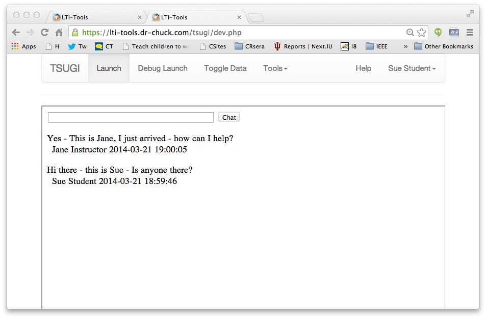

Chat Application
----------------

This application is intended to be a simple multi-user AJAX chat.

The student has a simple text field and a Chat button

The instructor has a Chat button, reset button, and a link to chatlist.php
for debugging.

The basic functionality of the tool is

* Any number of chats can be active.   Note that because cookies are *not*
used, testing of multiple accounts can be done frommultiple tabs of a single
browser.

* When the user enters a chat and pressed the Chat button it is inserted
into the table at the end with the current time using the MySql NOW() function.

* When the instructor presses the Reset button all the chats for the
link\_id are deleted from the table ($LTI['link\_id'])

* New chats are retrieved in the background from `chatlist.php` using AJAX
and displayed.   So if one user enters a chat in one tab, you should be able
to switch to the other tab and see the new chat without touching anything in
the application user interface.

Provided files
---------------

* `database.php` - This file automatically creates the table needed to store
the chat messages for each `link\_id` the schema for this table is as follows:

    create table {$CFG->dbprefix}sample_chat (
        link_id     INTEGER NOT NULL,
        user_id     INTEGER NOT NULL,
        chat        VARCHAR(1042) NOT NULL,
        created_at  DATETIME NOT NULL
    ...

* `index.php` - This is a very minimal file just enough to
launch `chatlist.php` and set up the PHPSESSIONID

* `chatlist.php` - This retrieves the current chats for the
current link\_id and provides them in a JSON format.

* `spinner.gif` - A spinner to be shown and hidden while the chats are being
retrieved.

What Is Needed
--------------

What is needed for this application is to extend the `index.php`
file to orchestrate the application.

